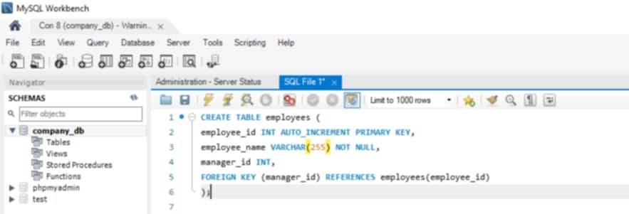

# Finals Lab Task 1: MySQL Basics
This task involves using MySQL Workbench to design and create a database that manages employees, their managers, departments, and projects. It organizes the data with proper table relationships so everything is connected and easy to manage visually and through SQL queries.

# Step 1
- Open the xampp, click start under Apache and MySQL, after that open the shell then open MySQL workbench.

# Step 2
- Create a database to store all the tables

# Step 3
- After inputing all the information, execute all the query to know if there's an error to your work.

## Task 1: CREATE DATABASE company_db;

### i. CREATE TABLE employees (
employee_id INT AUTO_INCREMENT PRIMARY KEY,

employee_name VARCHAR(255) NOT NULL,
manager_id INT,

FOREIGN KEY (manager_id) REFERENCES employees(employee_id)
);

DESCRIBE employees;

### ii. CREATE TABLE departments (
department_id INT AUTO_INCREMENT PRIMARY KEY,

department_name VARCHAR(255) NOT NULL);

DESCRIBE departments;

### iii. CREATE TABLE employee_departments (
employee_id INT,

FOREIGN KEY (employee_id) REFERENCES employees(employee_id),
department_id INT,

FOREIGN KEY (department_id) REFERENCES departments(department_id)
);

DESCRIBE employee_departments;

### iiii. CREATE TABLE employee_projects (
employee_id INT,

FOREIGN KEY (employee_id) REFERENCES employees(employee_id),

project_name VARCHAR(255) NOT NULL);

DESCRIBE employee_projects;

### iiiii. CREATE TABLE managers (
managers_id INT AUTO_INCREMENT PRIMARY KEY,

employee_id INT,

FOREIGN KEY (employee_id) REFERENCES employees(employee_id)
);

DESCRIBE managers;

# Here's the screenshot of my query statement and table structure
## Task 1

