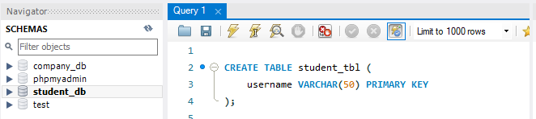
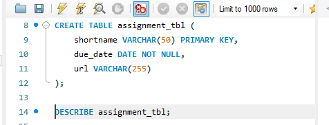
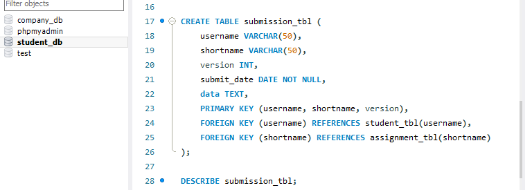
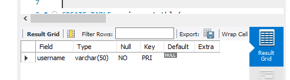
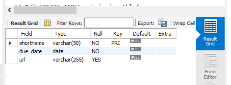
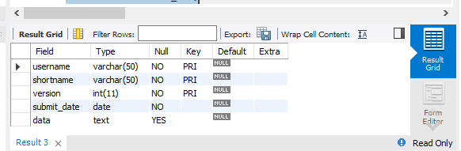
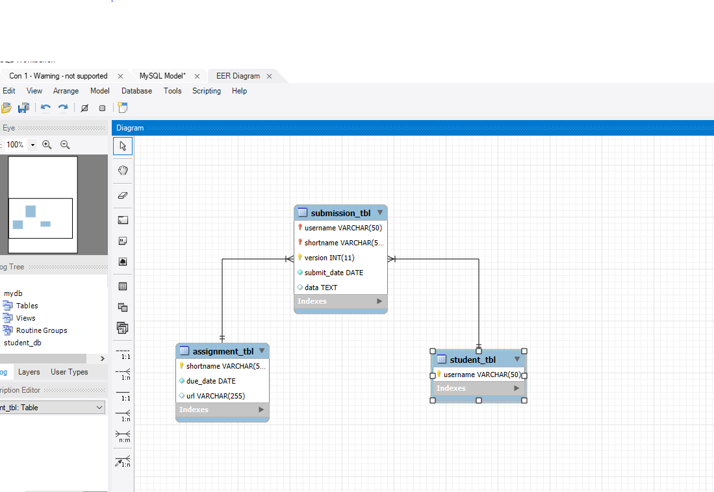

# Finals Lab Task 2: Transform ER into Relational Tables
In this activity, the data and all the necessary code were already provided. What I did was to connect all the tables to make everything look organized and easier to understand. I focused on identifying how each table is related to one another by establishing the appropriate connections, such as using primary and foreign keys. This helped make the database structure clearer and more presentable, and it also allowed for easier analysis and understanding of the relationships between different parts of the data.

# Step 1
- Open the xampp, click start under Apache and MySQL, after that open the shell then open MySQL workbench.
# Step 2
- Create database, then paste the provided data then execute each code.
# Step 3
- Go to Database in the left top, then click Reverse Engineer.
- Put necessary data then click next, Select your database, click next then execute and in the last part you can arrange your table base on what you want.

# Here's the screenshot of my QUERY STATEMENT
## Task 1
CREATE TABLE student_tbl (
    username VARCHAR(50) PRIMARY KEY
);

DESCRIBE student_tbl;

## Task 2
CREATE TABLE assignment_tbl (
    shortname VARCHAR(50) PRIMARY KEY,
    due_date DATE NOT NULL,
    url VARCHAR(255)
);

DESCRIBE assignment_tbl;

## Task 3
CREATE TABLE submission_tbl (
    username VARCHAR(50),
    shortname VARCHAR(50),
    version INT,
    submit_date DATE NOT NULL,
    data TEXT,
    PRIMARY KEY (username, shortname, version),
    FOREIGN KEY (username) REFERENCES student_tbl(username),
    FOREIGN KEY (shortname) REFERENCES assignment_tbl(shortname)
);

DESCRIBE submission_tbl;

# Here's the screenshot of TABLE STRUCTURE
## Task 1 Student

## Task 2 Assignment

## Task 3

# Here's the screenshot of ER DIAGRAM

