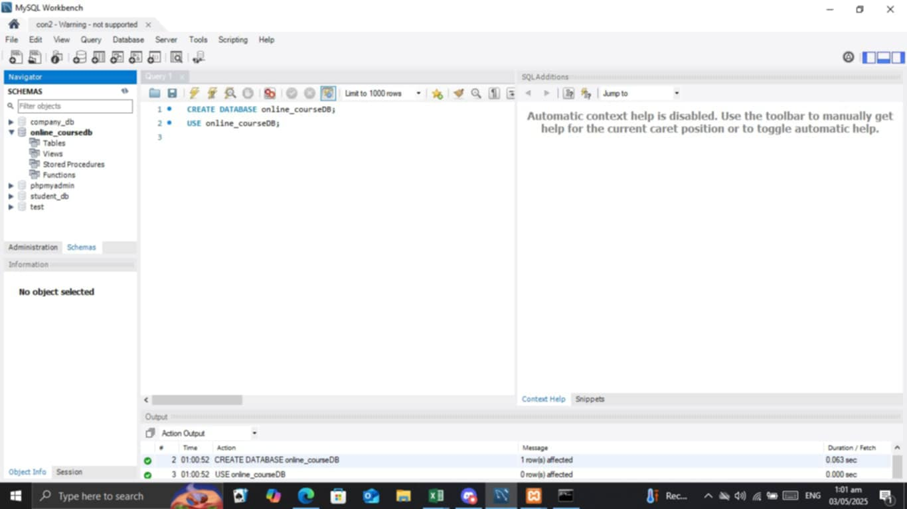

# Final Lab Task 3.1: Using MYSQL Clause
In this activity, querying a relational database using SQL. You will practice retrieving, grouping, and aggregating course data using SELECT statements and conditions. To analyze course enrollment details and generate insights such as fully enrolled courses, and total enrollments.

# Step 1
- Open xampp, click start to apache and mysql, and open MYSQL workbench
# Step 2
- Create database to store all data.
- Create table to organize each information.
- Code based on the instructions that has been given and execute it to see the result.
# Step 3
-  Go to Database in the left top, then click Reverse Engineer.
- Put necessary data then click next, Select your database, click next then execute and in the last part you can arrange your table based on what you want.

# Here's the screenshot of my QUERY STATEMENT and TABLE STRUCTURE
## Task 1
CREATE TABLE products (
id INT AUTO_INCREMENT PRIMARY KEY,
product_name VARCHAR(100) NOT NULL,
price DECIMAL(10,2)
);

DESCRIBE products;

ALTER TABLE products
ADD CONSTRAINT edit_price CHECK(price>0);

DESCRIBE products;

INSERT INTO products
(product_name,price) VALUES
('Laptop', 999.99),
('Headphones', -49.99),
('Smartphone', 599.99),
('Tablet', 299.99),
('Monitor', -149.99),
('Keyboard', 19.99),
('Mouse', 14.99),
('Desk Lamp', 24.99),
("External Hard Drive", -79.99),
('Speakers', 9.99);

ALTER TABLE products
MODIFY product_name VARCHAR(120) NOT NULL;

DESCRIBE products;

## Task 2

## Task 3

## Task 4

## Task 5

## Task 6

## Task 7

## Task 8

# Here's the screenshot of my ER DIAGRAM
.jpg)

 

