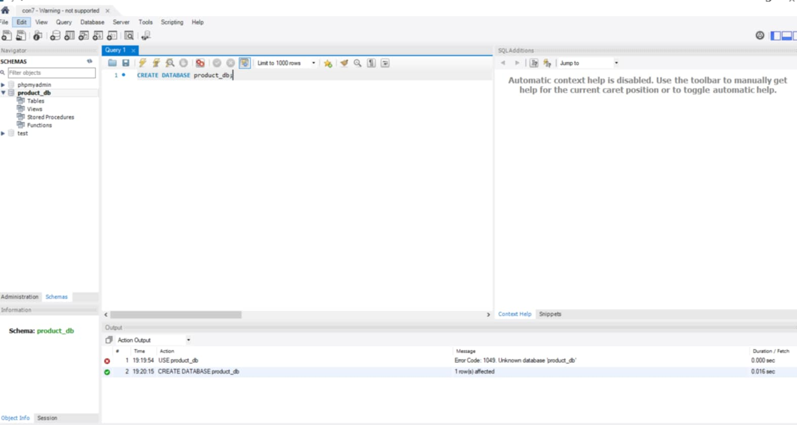
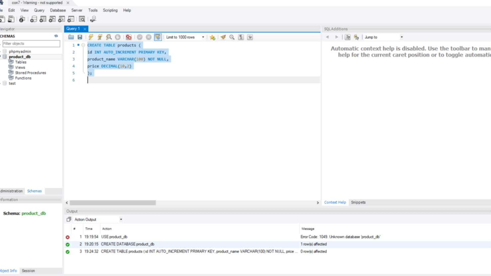
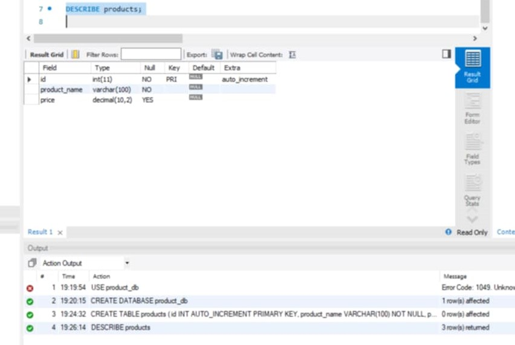
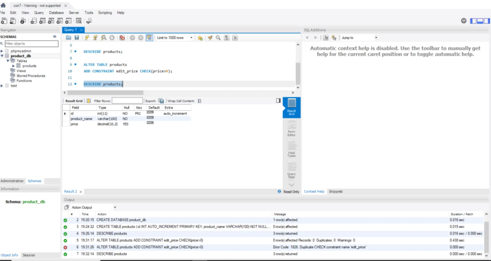
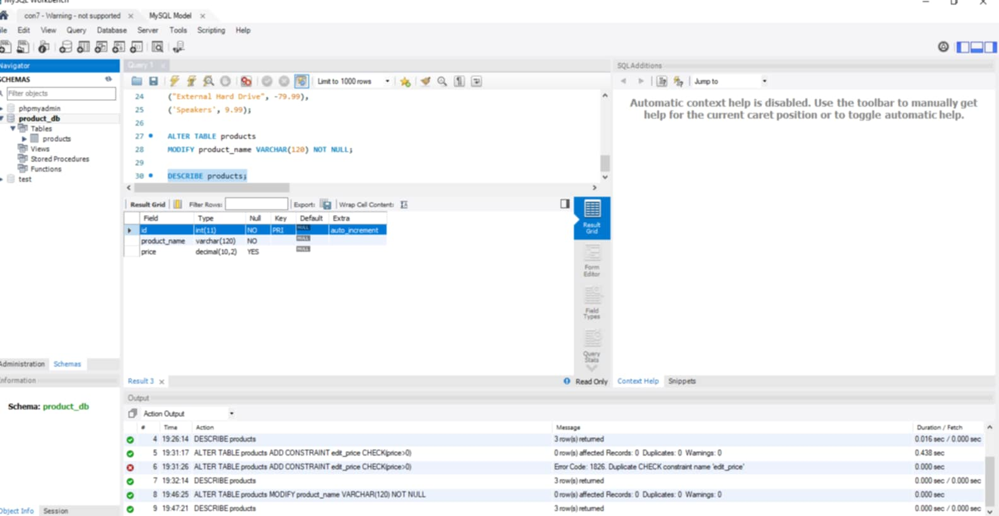
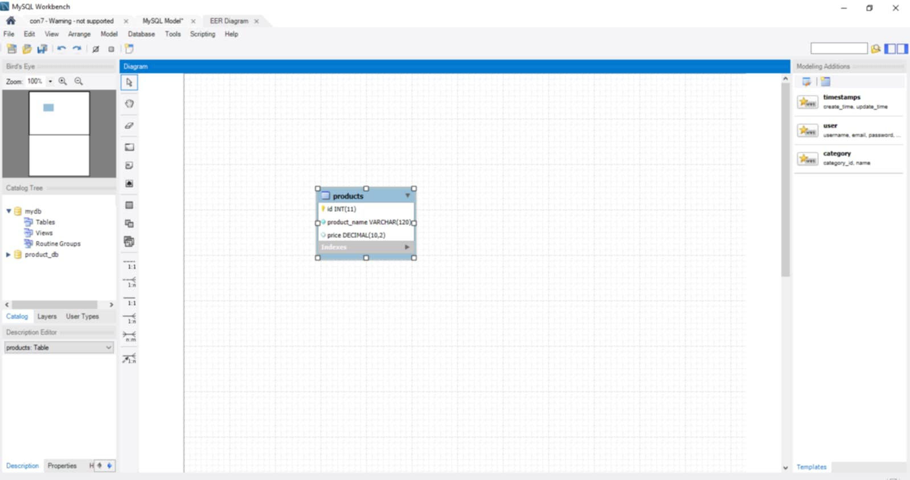

# Final Lab Task 3: Table Manipulation
In this activity using MySQL statements to perform table creation, apply constraints, insert data, and modify the table structure.
# Step 1
- Open xampp, click start to apache and mysql, and open MYSQL workbench
# Step 2
- Create database to store all data.
- Create table to organize each information.
- Code based on the instructions that has been given and execute it to see the result.
# Step 3
- Go to Database in the left top, then click Reverse Engineer.
- Put necessary data then click next, Select your database, click next then execute and in the last part you can arrange your table based on what you want.

# Here's the screenshot of my QUERY STATEMENT
## Task 1 CREATING DATABASE

## Task 2 
CREATE TABLE products (
id INT AUTO_INCREMENT PRIMARY KEY,
product_name VARCHAR(100) NOT NULL,
price DECIMAL(10,2)
);

DESCRIBE products;

ALTER TABLE products
ADD CONSTRAINT edit_price CHECK(price>0);

DESCRIBE products;

INSERT INTO products
(product_name,price) VALUES
('Laptop', 999.99),
('Headphones', -49.99),
('Smartphone', 599.99),
('Tablet', 299.99),
('Monitor', -149.99),
('Keyboard', 19.99),
('Mouse', 14.99),
('Desk Lamp', 24.99),
("External Hard Drive", -79.99),
('Speakers', 9.99);

ALTER TABLE products
MODIFY product_name VARCHAR(120) NOT NULL;

DESCRIBE products;

# Here's the screenshot of my TABLE STRUCTURE
## Task 1 Product

## Task 2 Manipulated Data

# Here's the screenshot of my DIAGRAM

