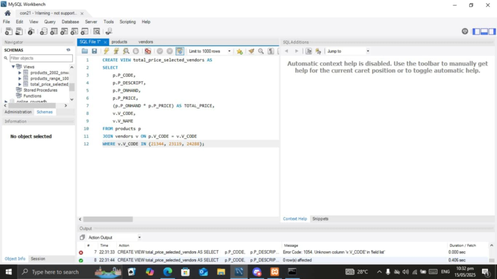

# Final Lab Task 5: Using SQL Views, Stored Procedures and Stored Function
This activity focuses on learning how to use SQL Views, Stored Procedures, and Stored Functions to efficiently manage, organize, and retrieve data from a database, enabling better performance, code reusability, and simplified access to complex queries.

# Step 1
- Open your xampp, start the apache and mysql, click shell, then open MYSQL Workbench
- Input the provided information
# Step 2
- Right click the specific table that stored in the table column to show the data inside the table
# Step 3
- Create views based on the instructions that has been given

# Here's the screenshot of my SQL QUERY
## Task 1
CREATE VIEW products_2002_onwards AS
SELECT
v.V_CODE AS vendors_code,
v.V_NAME AS vendors_name,
p.P_DESCRIPT AS product_description,
p.P_INDATE
FROM products p
JOIN vendors v on p.V_CODE = v.v_code
WHERE YEAR(p.P_INDATE) >= 2002;

## Task 2
CREATE VIEW products_range_100_150 AS
SELECT
p.P_CODE,
p.P_DESCRIPT,
p.P_PRICE,
p.P_INDATE
FROM products p
WHERE (p.P_PRICE) BETWEEN 100 AND 150;

## Task 3
CREATE VIEW total_price_selected_vendors AS
SELECT 
    p.P_CODE,
    p.P_DESCRIPT,
    p.P_ONHAND,
    p.P_PRICE,
    (p.P_ONHAND * p.P_PRICE) AS TOTAL_PRICE,
    v.V_CODE,
    v.V_NAME
FROM products p
JOIN vendors v ON p.V_CODE = v.V_CODE
WHERE v.V_CODE IN (21344, 23119, 24288);

## Task 4
DELIMITER //
CREATE PROCEDURE UpdateVendorName()
BEGIN
    UPDATE vendors 
    SET V_NAME = 'Bryson and Co' 
    WHERE V_NAME = 'Bryson, Inc.';
END //
DELIMITER ;

# Here's the screenshot of my TABLE STRUCTURE
## Task 1

## Task 2

## Task 3

## Task 4

