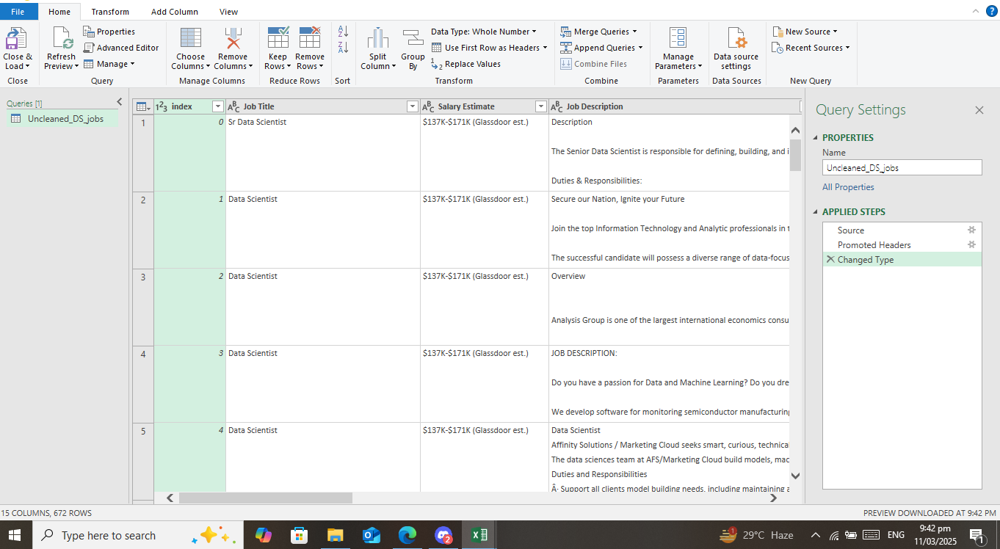

# Midterm Lab Task 2: Data Cleaning and Preparation using POWER QUERY

# Step 1 Import and Set Up Data
- Load the dataset from a CSV file.
- Promote the first row to headers.
- Change data types for various columns to ensure correct processing.

# Step 2 Salary Cleaning and Extraction
- Extract the salary estimate by removing any text inside parentheses.
- Sort salaries in ascending order.
- Extract the minimum salary by taking text between delimiters "$" and "K".
- Rename the extracted column to "Min Sal".
Sort salaries in descending order.
- Extract the maximum salary using the same delimiter method.

# Step 3 Categorizing Job Titles
- Create a new column "Role Type", classifying jobs into:
- Data Scientist
- Data Analyst
- Data Engineer
- Machine Learning Engineer
Other

# Step 4 Cleaning Location Data
- Standardize location names by mapping specific locations to state abbreviations.
- Split the "Location Correction Custom" column into two:
- State Full Name
- State Abbreviation
- Replace incorrect values (e.g., "Anne Rundell" to "MA").

# Step 5 Cleaning Company Size Data
- Extract the minimum company size from the "Size" column.
- Extract the maximum company size by finding text between spaces.

# Step 6 Filtering and Removing Unnecessary Data
- Remove rows where:
Competitors is "-1".
- Revenue is unknown or falls within certain values.
- Industry is "-1".
- Remove the "Job Description" column.

# Step 7 Cleaning Company Names
- Trim any extra spaces from Company Name.
- Remove unwanted terms from Company Name.
- Split Company Name by delimiter "#(lf)" to clean further.
- Capitalize each word in Company Name.
- Remove duplicate company names.
- Rename columns accordingly.
  
# Step 8 Final Sorting and Cleanup
- Sort rows based on the State
- Abbreviation column.
- Rename columns for clarity.

# Step 9 Here's the screenshot of my output before Data Cleaning and Preparation using POWER QUERY

# Step 10 Here's the screenshot of my output before Data Cleaning and Preparation using POWER QUERY

# STEP 11 Here's the screenshot of my QUERIES DEPENDENCIES and REFERENCE

